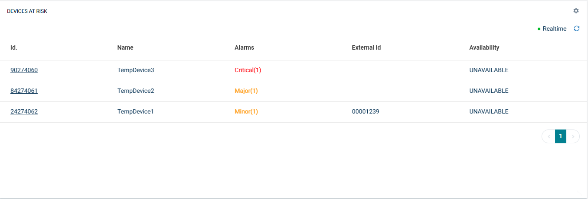

# Cumulocity Devices at Risk Widget Plugin 

This Cumulocity Devices at Risk Widget is the Cumulocity module federation plugin created using c8ycli. This plugin can be used in Application Builder or Cockpit. This plugin is designed to get a list of devices based on a group selection and display any device that has a Critical/Major Alarm or Medium/High-Risk Firmware raised against it.
One can also see the Availability of those devices and can also view the data both in Real-time/offline mode.

### Please choose Cumulocity Devices at Risk Widget Plugin release based on Cumulocity/Application builder version:

|APPLICATION BUILDER &nbsp; | &nbsp; CUMULOCITY &nbsp; |&nbsp; DEVICE AT RISK WIDGET PLUGIN &nbsp; |
|--------------------|----------------------|------------------------------|
| 2.0.x              | >= 1016.x.x | 1.x.x                  | 

## Features
 - Displays Assets/Devices for given group in grid mode.
 - When you click on the Id it will navigate to that particular dashboard.  
 - Pagination: Configurable Paginations and option to set default page size.

## Prerequisite
   Cumulocity c8ycli >=1016.x.x
   
## Installation

  
### Runtime Widget Deployment?

* This widget support runtime deployment. Download [Runtime Binary](https://github.com/SoftwareAG/cumulocity-device-at-risk-widget-plugin/releases/download/1.0.0/sag-ps-pkg-device-at-risk-runtime-widget-1.0.0.zip) and install via Administrations --> Ecosystems --> Applications --> Packages 

## QuickStart

This guide will teach you how to add widget in your existing or new dashboard.

1.  Open your application from App Switcher
    
2.  Add new dashboard or navigate to existing dashboard
    
3.  Click  `Add Widget`
    
4.  Search for  `Device at risk`
    
5.  Select  `Target Assets or Devices`
    
6.  Click  `Save`
    
Congratulations! Device at risk widget is configured.

## User Guide
Click on Add Widget and select Devices at Risk as a widget plugin. In the configuration, you only need to select the device group of interest.
-   **Target assets or devices:**  User can select a device/asset or device/asset group. If group is selected, list of devices/assets will be display.
    
-   **Table Settings:**  User can select table inputs such as  id, name, alarms, external id, firmware, availability  front page of tile. User can also select the inputs  to be configured for display.
    
-   **Default PageSize  :** Select records per page.
    
-   **Dashboard Navigation Settings (Application Builder Only):**  This feature is available only in application builder. User can navigate to any other dashboard by providing below details:
    -  ** **All**:**  Select a device type. Navigation will be applied to all the devices/assets of this device/asset to a specific dashboard
    -   **Dashboard ID:**  Dashboard ID of a dashboard where user need to navigate. You can find dashboard id in browser URL.
    -   **DeviceId as TabGroup:**  Select this option only if you are using Group Template as dashboard in application builder and selected deviceId as tabgroup field during group template configuration.
    -   **TabGroup ID(optional):**  If your dashboard is based on tabgroup then provide tabgroup id.
        
**Device at risk On Screen Options:**

-   **Realtime**  : On/Off Realtime option.
-   **Refresh**: Useful for force reload/refresh devices.
-   **Pagination**: Page navigation options.

------------------------------

This widget is provided as-is and without warranty or support. They do not constitute part of the Software AG product suite. Users are free to use, fork and modify them, subject to the license agreement. While Software AG welcomes contributions, we cannot guarantee to include every contribution in the master project.
_____________________
For more information you can Ask a Question in the [TECH Community Forums](https://tech.forums.softwareag.com/tag/Cumulocity-IoT).
